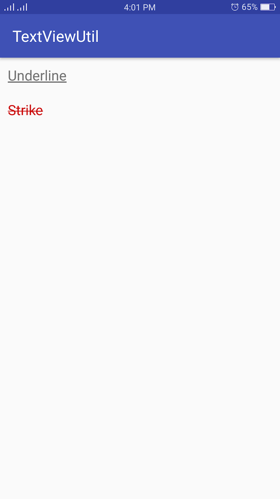

# TextViewUtil Android

## Getting Started

Android TextView Util Using for extra TextView Function such as Underline, Strike in Kotlin Language

## Demo


## Installing

We can install this library by using gradle

Step 1

```
allprojects {
	repositories {
			maven { url 'https://jitpack.io' }
		}
	}
```

Step 2

```
dependencies {
	        compile 'com.github.BondolTuon:TextViewUtilAndroid:1.0.3'
	}
```

## Sample Using

```
class MainActivity : AppCompatActivity() {

    override fun onCreate(savedInstanceState: Bundle?) {
        super.onCreate(savedInstanceState)
        setContentView(R.layout.activity_main)

        tvUnderline.underline()

        tvStrike.strike()
    }
}

```

## Min SDK Version

```
Support Min Sdk version >= 14

```

## Authors

* **Bondol Tuon** - [Bondol Tuon](https://github.com/BondolTuon)

See also the list of [contributors](https://github.com/BondolTuon/TextViewUtilAndroid/contributors) who participated in this project.

## License

This project is licensed under the MIT License - see the [LICENSE.md](https://github.com/BondolTuon/TextViewUtilAndroid/blob/1.x/README.md) file for details
